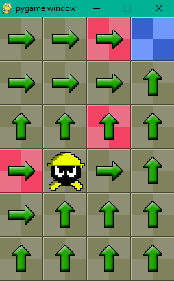

# MDP-Viteration-Qvalue
Simulación de Markov decision process con el algoritmo Value Iteration y algoritmo Q-Value

## Intrucción
Para iniciar la iteración dentro de la interfaz apretar la tecla V

## Captura de la interfaz gráfica

## Construido con 🛠️

* [Python 2.7](https://www.python.org/downloads/release/python-2718/)
* [Pygame](https://www.pygame.org/)

## Autores ✒️

* **Nicolás Rivas** [nrivas2017](https://github.com/nrivas2017)
* **Ignacio Ringler** [ringler0](https://github.com/ringler0)
